# Animus Datalab


> **Enterprise digital laboratory for machine learning** that organizes the full ML development lifecycle in a managed, reproducible form within a single operational context with common execution, security, and audit rules.

**Language:** Go / Python / SQL  •
**Execution model:** Control Plane + Data Plane  •
**Runtime:** Kubernetes  •
**Source of truth:** PostgreSQL  •
**Artifact storage:** S3-compatible object storage

## Overview

Animus Datalab is a centralized ML platform designed for enterprise environments where **reproducibility**, **auditability**, and **security** are non-negotiable. It manages the complete lifecycle from datasets through experiments, runs, artifacts, and model promotion — all within a single governance context.

The platform exists to solve a specific operational problem:

* keep **dataset versions, code references, environment locks, and execution parameters** centralized, immutable, and authoritative,
* execute **user workloads in isolated, containerized environments** on Kubernetes with enforced resource and network policies,
* produce **deterministic, reproducible runs** defined by the tuple (DatasetVersion, CodeRef commit SHA, EnvironmentLock, parameters, policy snapshot),
* maintain a **complete, append-only audit trail** for every state-changing action, access event, and privilege change,
* enforce **deny-by-default security** with SSO, project-scoped RBAC, and secrets management.

### Intended users

* **Data scientists and ML engineers** who need managed, reproducible experiment workflows with dataset versioning, artifact tracking, and model promotion.
* **Platform operators** who need controlled provisioning, quota enforcement, observability, and production-grade deployment for on-premise, private cloud, or air-gapped environments.
* **Security and compliance teams** who require append-only audit, RBAC enforcement, secrets redaction, and SIEM integration.
* **Maintainers and engineers** who need a clear layered architecture with strict Control Plane / Data Plane separation and predictable operational behavior.

### Core capabilities

* Control Plane / Data Plane separation with strict trust boundaries.
* Project-scoped isolation for all domain entities and operations.
* Dataset and DatasetVersion persistence with immutability enforcement.
* Run execution with deterministic planning and plan hashing.
* PipelineSpec validation with cycle detection and reference verification.
* Artifact storage with presigned URLs, checksums, retention policies, and legal hold.
* Append-only audit with NDJSON export and SIEM integration readiness.
* OIDC (and optional SAML) authentication with session TTL and forced logout.
* RBAC matrix with deny-by-default posture and object-level authorization.
* Model registry with validation/approval workflows and export policy controls.
* Managed developer environments with TTL, quotas, and audited remote access.
* Python SDK for programmatic interaction (git submodule).

---

## Architecture

This repository implements a **Control Plane / Data Plane architecture**. The Control Plane manages governance, policies, metadata, orchestration, and audit — it never executes user code. The Data Plane executes user workloads in isolated, containerized Kubernetes environments.

### Architecture principles

* **Control Plane never executes user code.**
* **Data Plane executes in isolated, containerized environments.**
* **PostgreSQL is the authoritative metadata store.**
* **S3-compatible object storage holds all artifacts.**
* **A production-run is uniquely defined by DatasetVersion + CodeRef commit SHA + EnvironmentLock + parameters + policy snapshot.**
* **All significant actions are recorded as AuditEvent.**
* **All domain entities belong to exactly one Project; cross-Project dependencies are prohibited.**
* **The system has no hidden state that affects execution results.**
* **Deny-by-default security posture; explicit allowlists.**
* **Secrets are ephemeral, minimal in scope, and never exposed in UI, logs, metrics, or artifacts.**

### 1. System context

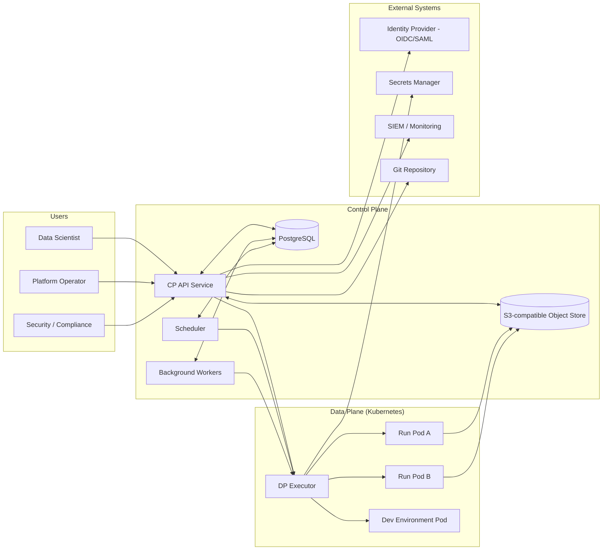

The Control Plane is the single decision-making authority. Users interact only with the CP API. The Data Plane receives execution instructions from the Control Plane and reports back status, heartbeats, and terminal states.

### 2. Trust boundary view

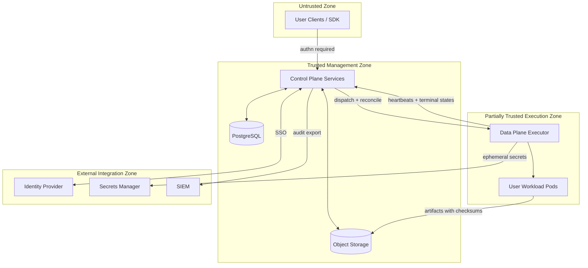

Trust boundaries treat user clients as untrusted, Control Plane as trusted management, Data Plane as partially trusted execution, and external systems as separate zones integrated through contractual interfaces.

### 3. Actor interaction view

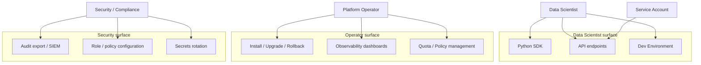

Role separation is enforced server-side through project-scoped RBAC with deny-by-default posture. Service accounts are subject to the same RBAC and are audited.

### 4. Use-case view

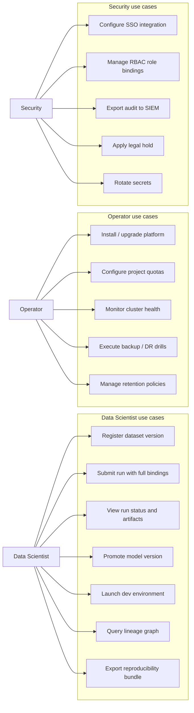

### 5. High-level container view

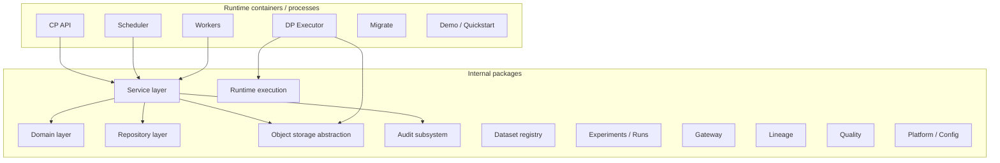

### Responsibilities

* **CP API**: all business-facing HTTP endpoints, authentication, authorization, reads, mutations, reproducibility bundle export.
* **Scheduler**: queue management, priority handling, quota enforcement, dispatch to Data Plane.
* **Workers**: background reconciliation, health checks, usage collection, quota and expiry enforcement.
* **DP Executor**: Kubernetes workload launcher, heartbeat reporting, terminal state delivery, artifact commit.
* **Migrate**: schema evolution for PostgreSQL.
* **Demo / Quickstart**: containerized local development and smoke testing stack.

### 6. Internal module breakdown

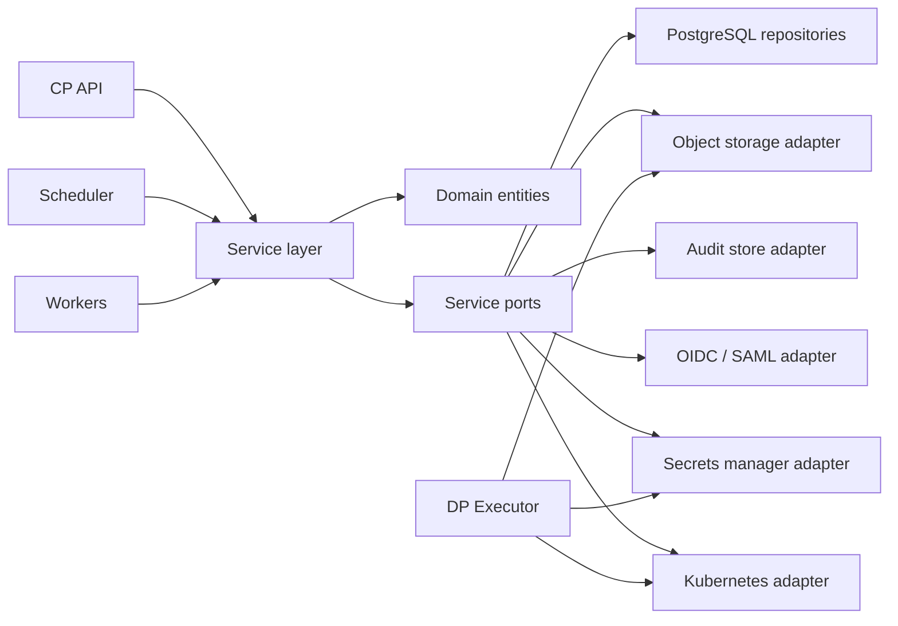

#### Layer responsibilities

* **Domain**
    + domain entities (Project, Dataset, DatasetVersion, Run, Artifact, ModelVersion, AuditEvent, CodeRef, EnvironmentLock, PipelineSpec),
    + status models and state machines,
    + value objects,
    + plan hash computation rules,
    + VLESS export builder rules (from linked submodule, if applicable).
* **Service**
    + orchestrates use cases,
    + owns business transitions,
    + depends only on ports (interfaces),
    + enforces production-run gate requirements.
* **Infrastructure**
    + PostgreSQL persistence,
    + S3-compatible object storage,
    + OIDC/SAML authentication,
    + secrets manager integration,
    + Kubernetes workload management,
    + audit store and export.
* **Transport**
    + HTTP API handlers, middleware, schemas,
    + CP↔DP execution protocol (internal).

### 7. Data flow

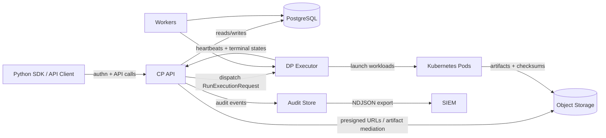

The platform does not trust Data Plane state as authoritative. The DP provides execution evidence and artifact commits; PostgreSQL remains the canonical source of truth for all metadata.

### 8. Persistence / ER view

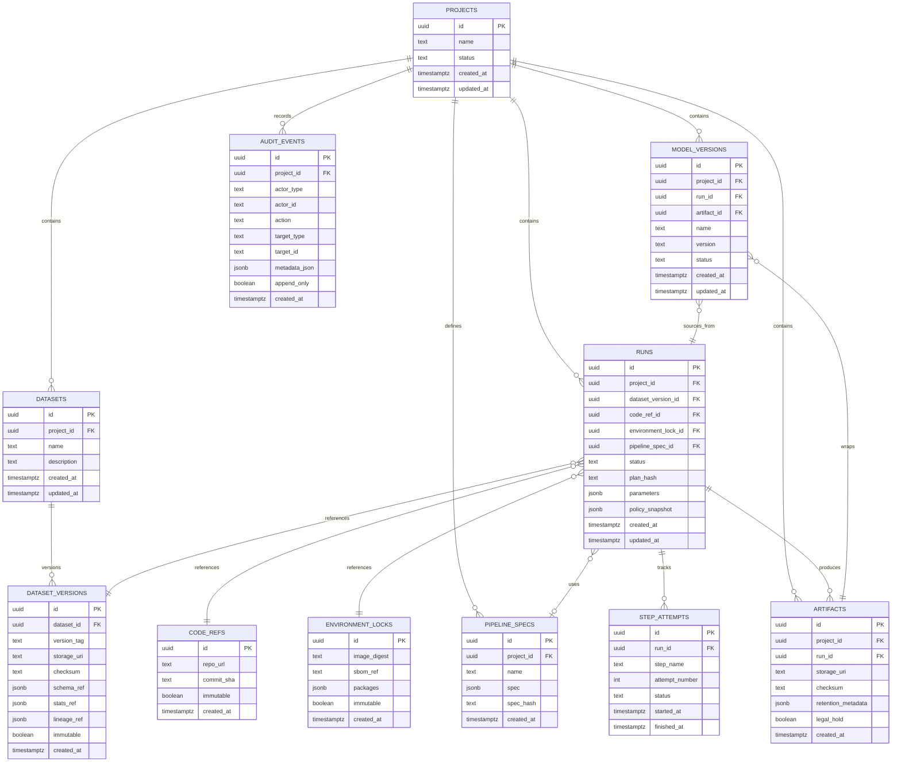

### Persistence notes

* `dataset_versions` are immutable after creation; enforced by database triggers.
* `code_refs` and `environment_locks` are immutable per run.
* `audit_events` are append-only and non-disableable.
* `artifacts` include checksum verification and retention metadata.
* `runs` store a `policy_snapshot` capturing RBAC, retention, network policy, and template restrictions at the time of execution.
* All entities are project-scoped; cross-project queries are prohibited.

### 9. Core sequence: production-run submission

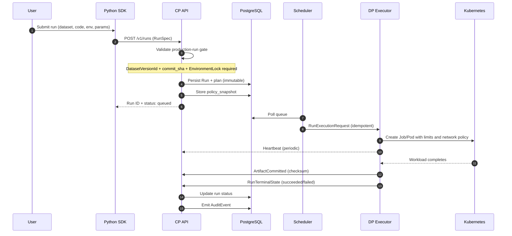

### 10. Core sequence: deterministic planning

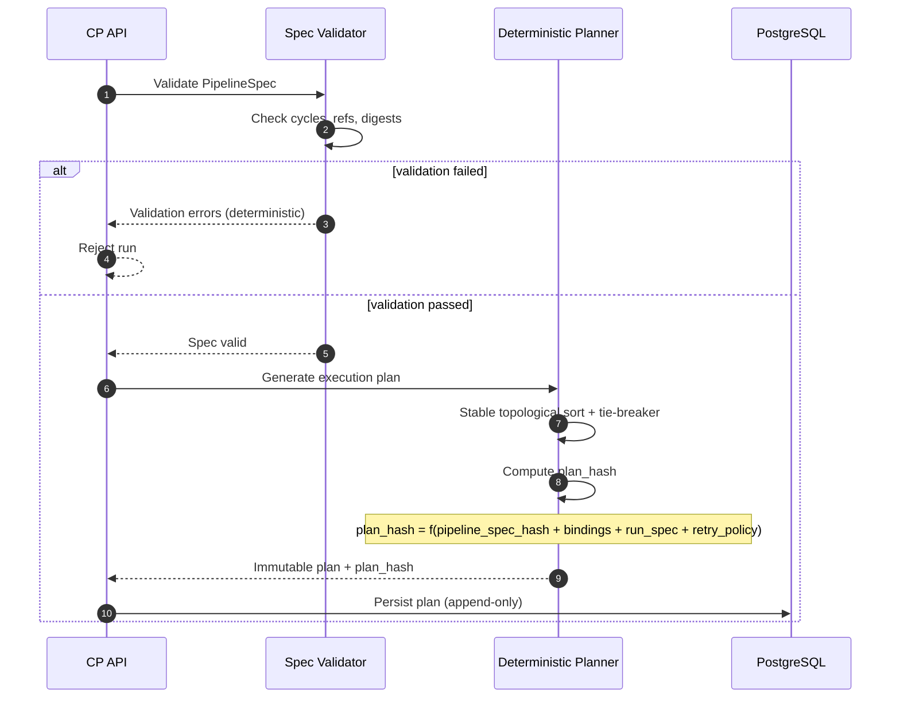

### 11. Core sequence: artifact commit

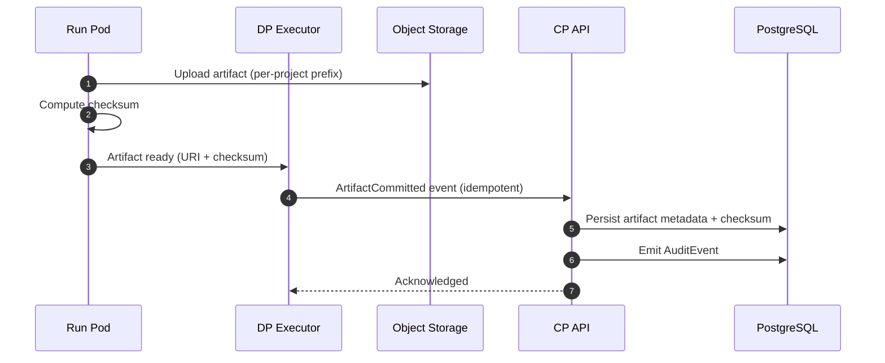

### 12. Worker / reconciliation flow

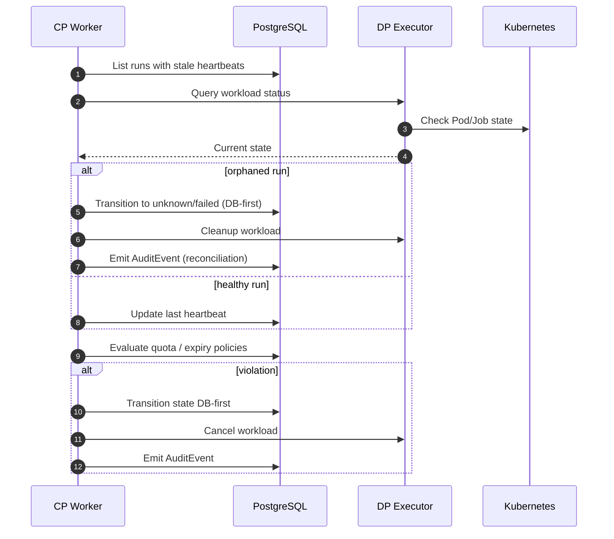

### 13. State models

#### Run lifecycle

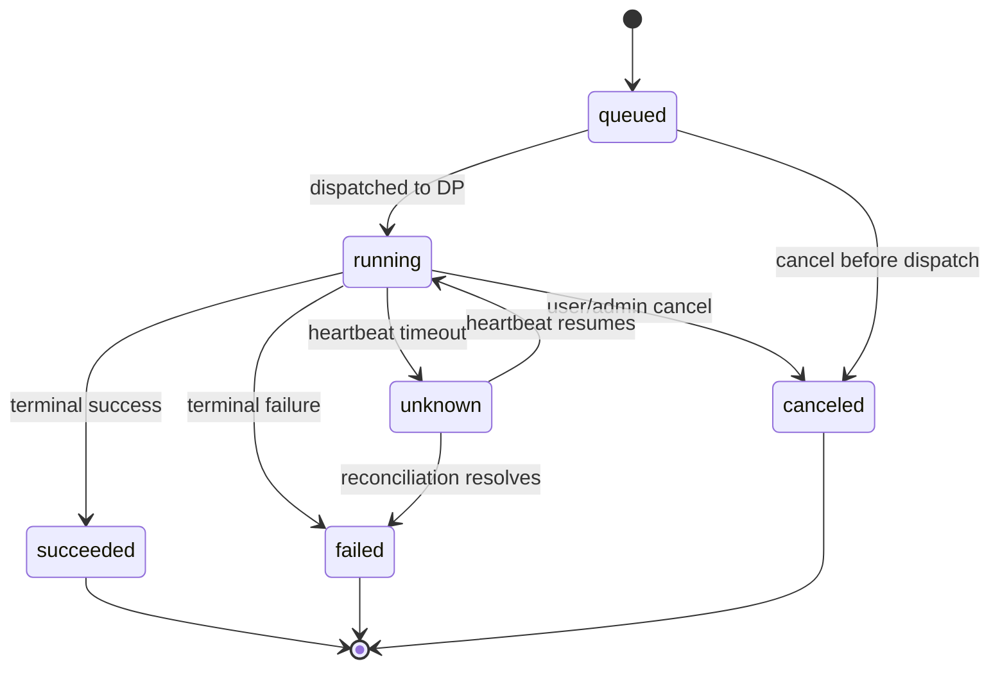

#### Model version lifecycle

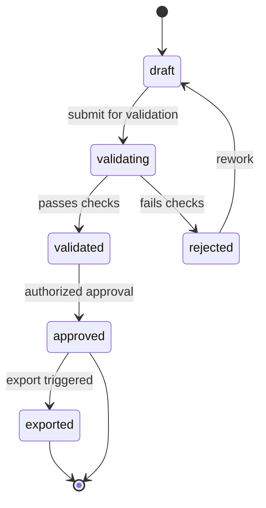

#### Project lifecycle

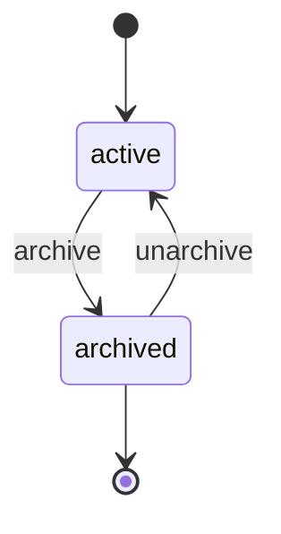

### 14. Core contracts and interfaces

#### CP ↔ DP protocol

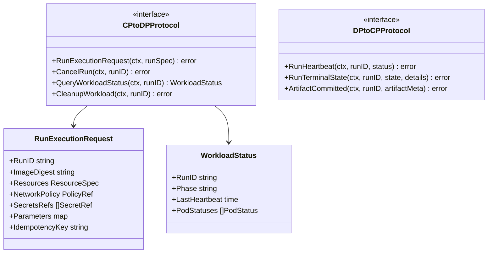

#### Repository boundary

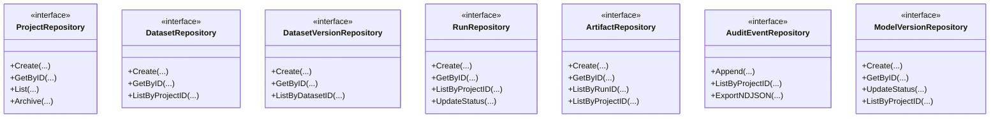

### 15. Async / subsystem dependency view

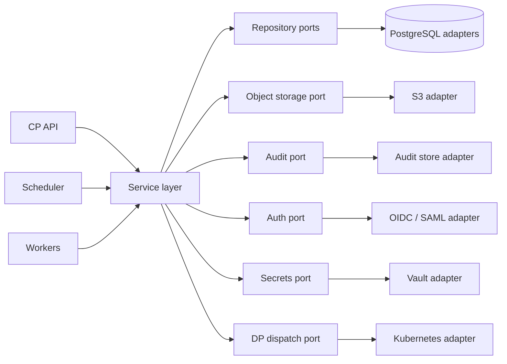

The service layer is the orchestrator. Everything else is either an adapter or a transport.

### 16. Deployment / infrastructure view

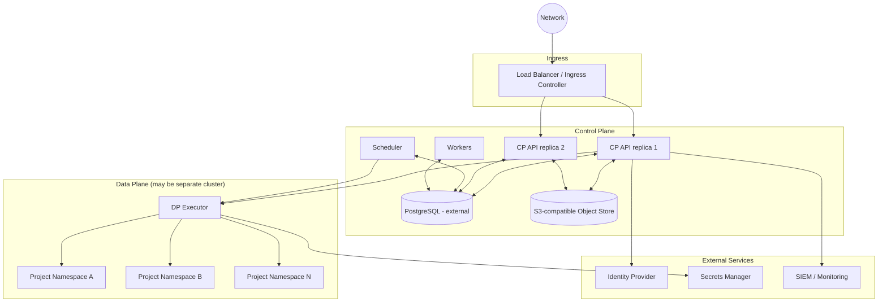

A production deployment uses Helm charts or Kustomize. The CP is stateless (replicas + external DB) for HA. The DP may run on a separate cluster. The platform supports on-premise, private cloud, and air-gapped deployments.

---

## Domain and system internals

### Key entities

#### Project

The isolation boundary and root container for all domain entities. A project may be active or archived. Archived projects become read-only. All queries are project-scoped; cross-project dependencies are prohibited.

#### Dataset / DatasetVersion

A dataset is a named collection within a project. DatasetVersion is an immutable snapshot referencing storage URI, checksum, schema, stats, and lineage. Immutability is enforced by database triggers.

#### CodeRef

An immutable reference to a specific commit SHA and repository URL. Required for production-runs.

#### EnvironmentLock

An immutable specification of the execution environment including image digest, package list, and optional SBOM reference. Required for production-runs.

#### Run

The minimal unit of execution and reproducibility. A Run is defined by its Project, DatasetVersion, CodeRef commit SHA, EnvironmentLock, execution parameters, and policy snapshot. Reproducibility is the ability to re-execute a Run and obtain results consistent with the recorded inputs; determinism is not assumed when bindings are missing or user code introduces non-determinism.

#### PipelineSpec

A validated, hashed specification of a multi-step DAG pipeline. Cycle detection and reference verification are enforced at validation time. Plan hashing is deterministic with stable topological ordering and tie-breaker rules.

#### Artifact

A versioned output of a Run, stored in S3-compatible object storage with checksums. Subject to retention policies and legal hold enforcement. Access is mediated and audited through the Control Plane.

#### ModelVersion

A lifecycle entity referencing a source Run and an Artifact. Subject to validation/approval workflows with RBAC-gated promotion and export policy controls.

#### AuditEvent

An append-only, non-disableable record of significant actions. Covers all state-changing operations, access to protected downloads, authentication events, privilege changes, and secrets access events (metadata only, never values). Exportable to SIEM via webhook/syslog with retries and idempotency.

### Business rules and invariants

#### DB-first orchestration

For run submission, status transitions, artifact commits, and model promotion, central state is persisted before any side effect is attempted.

#### Single authority

The platform never treats Data Plane state as canonical business state. The DP provides execution evidence; PostgreSQL remains authoritative.

#### Production-run gate

A production-run is accepted only when CodeRef commit SHA, EnvironmentLock, DatasetVersion references, and required policy approvals are explicit and recorded. Otherwise the Run is rejected or limitations are recorded in Run metadata and AuditEvent.

#### Deterministic planning

Plan hash is deterministic from (pipeline_spec_hash + bindings + run_spec + retry_policy). Stable topological ordering with tie-breaker rules. Idempotent create operations produce identical resources on duplicate requests.

#### Truthful failure handling

Failure states are explicit. The platform must not represent a partially executed run as fully succeeded. Reconciliation resolves orphaned runs; no manual status edits.

#### Append-only audit

Audit cannot be disabled. All state-changing operations, protected access, and privilege changes are recorded. Export supports SIEM integration with retries, idempotency, and per-project filters.

### Security boundaries

* OIDC (primary) and optional SAML authentication with session TTL, forced logout, and limits on parallel sessions.
* Project-scoped RBAC with deny-by-default; object-level authorization on sensitive reads, downloads, and exports.
* Secrets supplied via external secrets manager, ephemeral and minimal in scope, never exposed in UI, logs, metrics, or artifacts.
* Data Plane executes untrusted user code in containerized environments with restricted privileges; network access and resource limits enforced by policy.
* Control Plane never executes user code; enforced by `depguard` lint rules.
* Service accounts subject to the same RBAC and audited.
* CP/DP boundary enforced at the module level via static analysis.

---

## Repository structure

The repository is organized by visibility boundary (open/closed), with shared API specifications and documentation at the top level.

```
.
├── api/                          # OpenAPI / contract specifications
├── closed/                       # Proprietary implementation
│   ├── audit/                    # Audit subsystem
│   ├── dataset-registry/         # Dataset and DatasetVersion persistence
│   ├── deploy/                   # Docker Compose and deployment assets
│   │   └── docker-compose.yml    # Local dev stack
│   ├── experiments/              # Runs, plans, execution engine
│   ├── gateway/                  # API gateway / ingress
│   ├── internal/
│   │   ├── domain/               # Domain entities and value objects
│   │   ├── repo/postgres/        # PostgreSQL repository implementations
│   │   ├── runtimeexec/          # Data Plane runtime execution
│   │   ├── service/
│   │   │   └── artifacts/        # Artifact service with presigned URLs
│   │   └── storage/
│   │       └── objectstore/      # S3-compatible storage abstraction
│   ├── lineage/                  # Lineage tracking subsystem
│   ├── migrations/               # SQL schema migrations
│   ├── quality/                  # Data quality subsystem
│   └── scripts/
│       └── dev.sh                # Local development helper
├── open/                         # Open-source components
│   ├── demo/
│   │   └── quickstart.sh         # Demo / smoke test quickstart
│   └── sdk/                      # Git submodule
│       └── python/               # Python SDK (submodule)
│           ├── src/              # SDK source
│           └── tests/            # SDK tests
├── docs/
│   ├── assets/                   # Banner and visual assets
│   └── enterprise/               # Normative specification
├── tools/
│   └── cicd/                     # CI/CD tooling
├── .github/
│   └── workflows/                # GitHub Actions CI pipelines
├── .golangci.yml                 # Linter config with CP/DP depguard rules
├── .gitmodules                   # Python SDK submodule reference
├── go.mod                        # Go module definition
├── go.sum                        # Go dependency checksums
├── Makefile                      # Common dev commands
├── roadmap.json                  # Production-grade roadmap (M0-M9)
├── LICENSE                       # Apache-2.0
└── README.md
```

---

## Key flows

### Run submission flow

1. User submits RunSpec via Python SDK or API.
2. CP API validates production-run gate (DatasetVersion + commit SHA + EnvironmentLock).
3. CP persists Run, plan, and policy snapshot (DB-first).
4. Scheduler picks up queued run, dispatches to DP.
5. DP launches Kubernetes workload with resource limits and network policy.
6. DP reports heartbeats; CP updates last heartbeat.
7. Workload completes, artifacts uploaded with checksums.
8. DP reports terminal state; CP finalizes run status.
9. AuditEvents emitted throughout.

### Pipeline execution flow

1. PipelineSpec validated (cycles, refs, digests).
2. Deterministic plan generated with stable topological sort.
3. Plan hash computed and plan stored immutably.
4. Scheduler dispatches node-runs respecting DAG dependencies.
5. Retries/backoff applied per node; partial failure policies enforced.
6. Graph status tracked; all transitions audited.

### Reproducibility flow

1. User requests reproducibility bundle for a completed Run.
2. CP assembles: DatasetVersion, CodeRef (commit SHA + repo URL), EnvironmentLock (image digest + SBOM ref), parameters, policy snapshot.
3. Bundle hash computed (stable).
4. Replay creates a new Run from the snapshot and records the linkage.

### Model promotion flow

1. ModelVersion created from a source Run and Artifact.
2. Validation/approval workflow gated by RBAC.
3. Only authorized roles can approve; approval emits AuditEvent.
4. Export interface controlled by policy; exports audited.

### Dev environment flow

1. User requests dev environment within a project.
2. DP controller creates isolated Pod with TTL and quotas.
3. Network policies and template restrictions applied from project policy.
4. Remote access (terminal/IDE) mediated and audited.
5. Transition path from dev work to production-run submission.

### Background enforcement flow

1. Workers check for stale heartbeats and orphaned runs.
2. Reconciliation resolves to terminal states or resumes.
3. Quota and expiry policies evaluated.
4. Violations trigger DB-first state transitions and DP cleanup.
5. All reconciliation decisions audited.

---

## Technology stack

### Languages

* Go (91.4%)
* Python (SDK and tooling)
* SQL / PLpgSQL (migrations and triggers)
* Shell (scripts and CI)

### Control Plane

* Go HTTP API with structured logging and request ID propagation
* Deterministic planner with stable topological sort
* PostgreSQL for authoritative metadata
* S3-compatible object storage for artifacts

### Data Plane

* Kubernetes (Jobs/Pods) for workload execution
* Container isolation with resource limits and network policies
* Ephemeral secrets injection at execution time

### Identity and Security

* OIDC (primary) and SAML (optional) via `coreos/go-oidc`
* OAuth2 via `golang.org/x/oauth2`
* Vault-like external secrets manager
* Project-scoped RBAC with deny-by-default

### Persistence

* PostgreSQL (external supported) via `jackc/pgx`
* S3-compatible object storage via `minio/minio-go`

### Observability

* Prometheus + OpenTelemetry + structured logs
* Correlation IDs across CP and DP

### Packaging and Delivery

* Helm charts (preferred) and/or Kustomize
* Docker and Docker Compose for local development
* Air-gapped bundle support with integrity verification
* SBOM generation and vulnerability scanning in CI

### Tooling

* `golangci-lint` with `depguard` for CP/DP boundary enforcement
* GitHub Actions CI pipelines
* Makefile-based task runner
* Python `unittest` for SDK tests

---

## Setup, development, and operation

### Prerequisites

* Go 1.25+
* Docker and Docker Compose
* Python 3 (for SDK development and linting)
* PostgreSQL access for non-container workflows
* Git (with submodule support for Python SDK)

### Local development

Initialize the repository and dependencies:

```
make bootstrap
```

Initialize the Python SDK submodule:

```
git submodule update --init --recursive open/sdk
```

Start the local development stack:

```
make dev
```

Run the demo quickstart:

```
make demo
```

Run a smoke test:

```
make demo-smoke
```

Tear down the demo stack:

```
make demo-down
```

### Code quality

Format code:

```
make fmt
```

Run all linters (gofmt, go vet, golangci-lint, Python compileall):

```
make lint
```

Run all tests (Go + Python SDK):

```
make test
```

Build all packages:

```
make build
```

### Development notes

* `closed/deploy/docker-compose.yml` defines the local development stack.
* The Python SDK lives in `open/sdk/python/` as a git submodule.
* `api/` contains OpenAPI/contract specifications; breaking changes require a major version bump.
* `.golangci.yml` enforces CP/DP boundary: control plane packages (`audit`, `dataset-registry`, `gateway`, `lineage`, `quality`) are prohibited from importing `runtimeexec`.
* `docs/enterprise/` contains the normative specification; this README is an entry point and not the normative source.

### Production operation notes

Production deployment uses Helm charts or Kustomize and typically requires:

* Kubernetes cluster with namespace isolation per project.
* External PostgreSQL (non-public, backed up, with RPO/RTO targets).
* S3-compatible object storage with per-project prefix separation.
* OIDC-compatible identity provider (and optional SAML).
* External secrets manager (Vault-like) for ephemeral credential injection.
* SIEM integration for audit export (webhook/syslog).
* Prometheus + OpenTelemetry endpoints for observability.

Operational requirements:

* CP is stateless and supports horizontal scaling (replicas + external DB).
* DP may run on a separate cluster; multi-cluster-ready.
* Network policies must isolate user workload namespaces.
* All secrets must be ephemeral and minimal in scope.
* Backup/restore procedures must be validated; runbooks executed in drills.
* Air-gapped deployments require pre-built bundles with integrity verification and SBOM gates.

---

## Roadmap

The production-grade roadmap is tracked in `roadmap.json` and structured across 10 milestones (M0–M9).

### Milestone summary

* **M0 — Foundations & Architecture Baseline** *(done)*: CP/DP boundary, repo boundaries, Kubernetes baseline, object storage abstraction.
* **M1 — Domain Model & Metadata Core** *(done)*: Project/Dataset/DatasetVersion/Artifact/AuditEvent persistence, immutability enforcement, audit export MVP.
* **M2 — Execution Contracts, Runs & Deterministic Planning** *(in progress)*: PipelineSpec validation, RunSpec bindings, plan persistence, deterministic hashing, dry-run executor.
* **M3 — Data Plane Runtime & Real Execution**: DP executor on Kubernetes, CP↔DP protocol, artifacts commit, reconciliation.
* **M4 — Scheduling, Queues, Quotas, Cancellation**: Production-grade scheduling, retry/backoff, cancellation end-to-end.
* **M5 — Security & Governance Hardening**: SSO, RBAC matrix, secrets TTL, SIEM-grade audit export, retention policies.
* **M6 — Pipelines (DAG) & Orchestration**: PipelineRun with node-runs, DAG engine, graph query APIs.
* **M7 — Developer Environments**: Managed dev environments with audited remote access, TTL, templates.
* **M8 — Model Registry & Promotion**: Model lifecycle, validation/approval, export hooks, lineage integration.
* **M9 — Operability, HA/DR, Packaging, Supply Chain, E2E Acceptance & Release**: HA, observability, backups/DR, Helm packaging, air-gapped/SBOM gates, automated E2E acceptance.

### Production-grade definition

The platform is production-grade when all mandatory acceptance criteria are satisfied and verified on a working installation with security and audit policies enabled:

* End-to-end ML lifecycle runs within a Project without external stitching.
* Any production-run reproducible from DatasetVersion + commit SHA + EnvironmentLock.
* All state-changing actions audited, append-only, exportable.
* SSO + RBAC enforced end-to-end with object-level authorization.
* Install/upgrade/rollback automated and documented.
* No implicit state; every result explainable via domain graph.
* HA control plane, observability, backup/DR validated.

---

## Explicit non-goals

* Built-in Git hosting or full IDE replacement.
* A full inference platform (export to external systems is supported).
* A standalone Feature Store product (interfaces may be integrated).

---

## Documentation

The authoritative specification is in `docs/enterprise/`. This README is an entry point and is not the normative source.

---

## License

Apache-2.0. See [LICENSE](LICENSE).

---

## Contact

For engineering, maintenance, or operational contact:

**[rewanderer@proton.me](mailto:rewanderer@proton.me)**