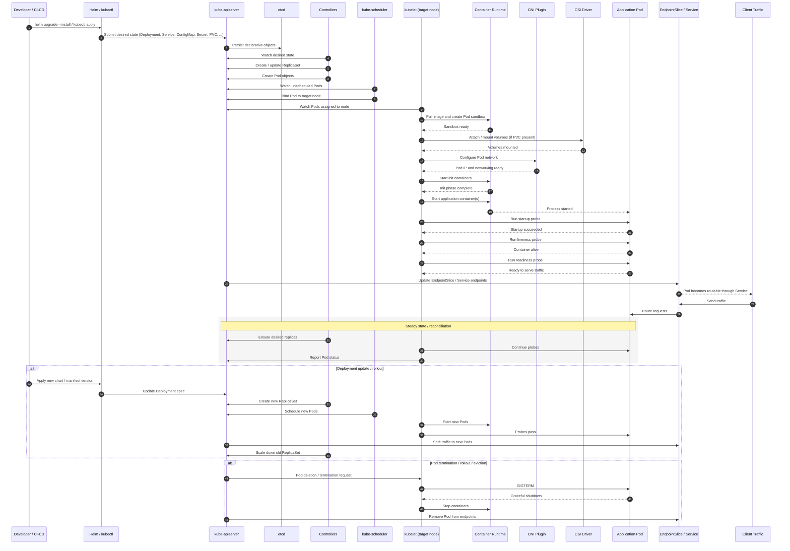
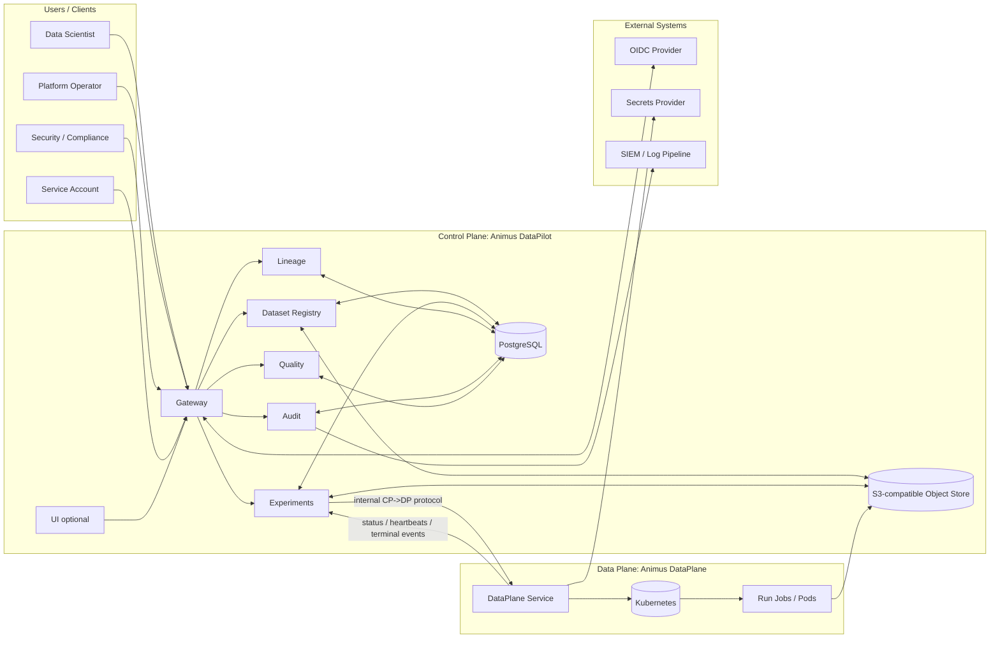
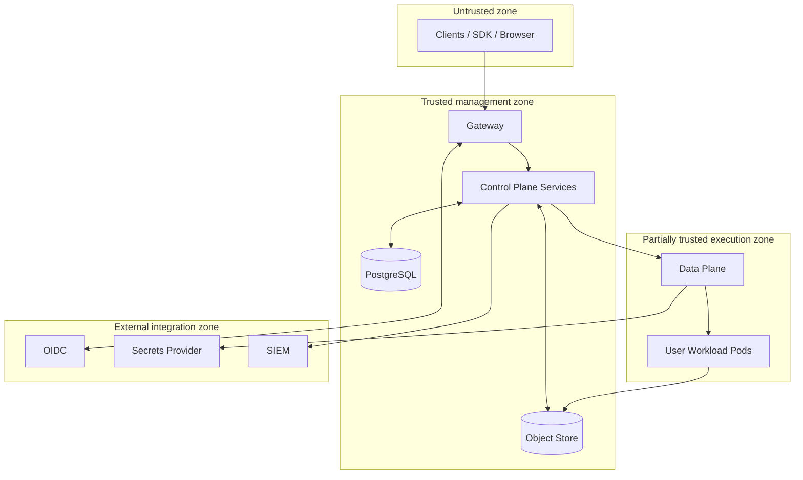
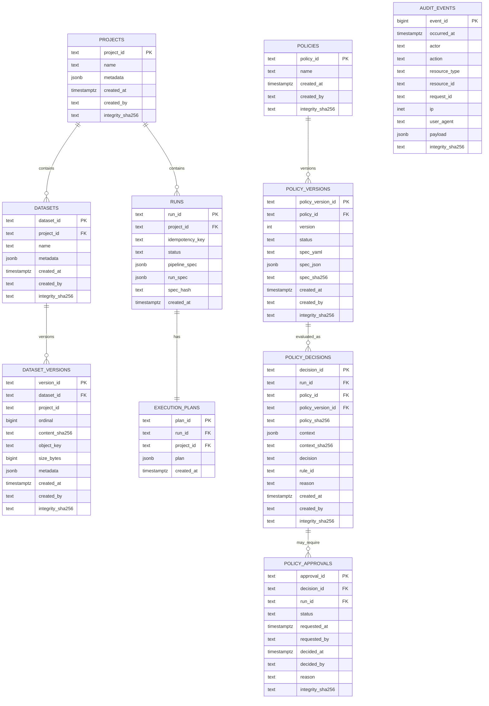
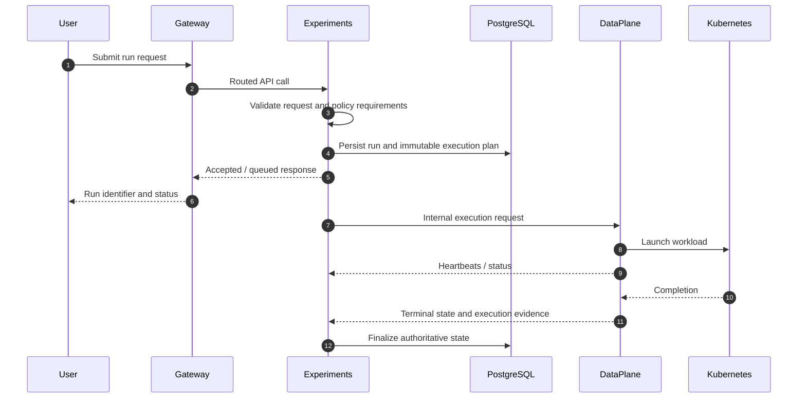
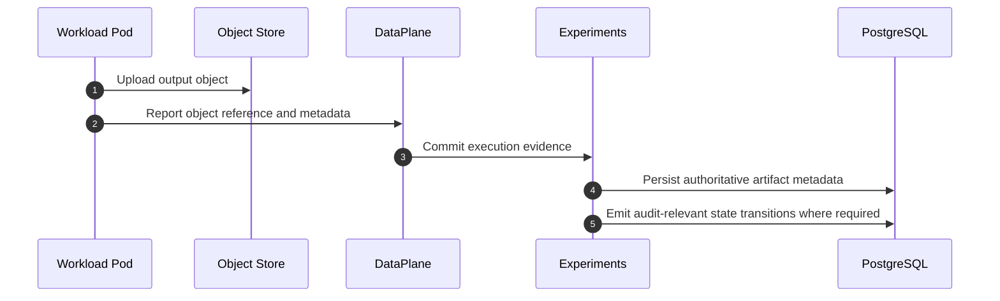
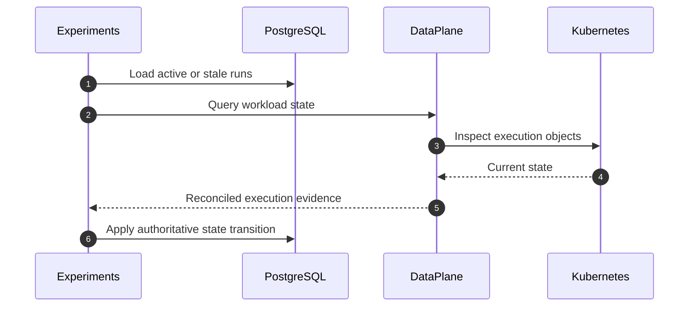
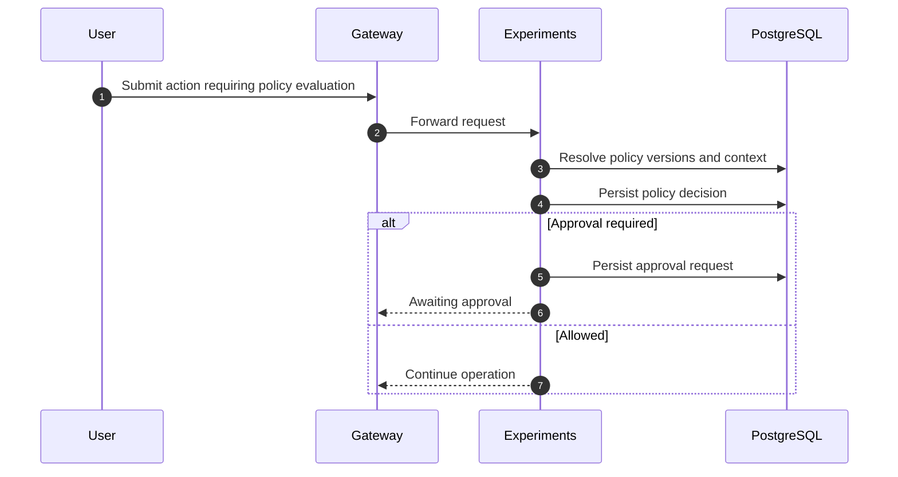

> **Enterprise digital laboratory for machine learning** that organizes the full ML development lifecycle in a managed, reproducible form within a single operational context with common execution, security, and audit rules.

**Primary language:** Go (services)
**Data / policy layer:** PostgreSQL migrations (SQL/PLpgSQL)
**Runtime:** Kubernetes (production) • Docker Compose (local development and demo)
**Execution model:** Control Plane (**Animus DataPilot**) + Data Plane (**Animus DataPlane**)
**Authoritative metadata store:** PostgreSQL
**Object and artifact storage:** S3-compatible object storage
**Contracts:** OpenAPI and baseline specifications in `core/contracts/*`

---

## Scope and repository model

This repository is the open-core host for **Animus Datalab**.

### Canonical roots

The stable top-level roots used by the codebase, scripts, and deployment assets are:

* `core/contracts` — canonical API contracts, schemas, and compatibility baselines
* `deploy` — Helm charts, Dockerfiles, and policy assets
* `closed/*` — Control Plane and Data Plane service implementations
* `scripts` — development, CI, hygiene, and release tooling
* `docs` — enterprise, operational, security, and architecture documentation

### Submodules and migration stubs

The repository contains scaffolding for an externalized split model:

* `./enterprise` — target location for enterprise repository content
* `./sdk` — target location for SDK repository content

During migration, several legacy paths remain as explicit compatibility shims and should not be treated as canonical sources of truth:

* `open/api` — legacy contracts shim; use `core/contracts/*`
* `open/sdk` — legacy SDK shim; use `sdk`
* `closed/deploy` — legacy deploy shim; use `deploy/*`
* `closed/scripts` — legacy enterprise scripts shim

When repository structure and generated assets disagree, the canonical sources are:

1. migrations in `closed/migrations/`
2. deployment values in `deploy/helm/*/values.yaml`
3. service implementations in `closed/*`
4. contracts in `core/contracts/*`
5. operational and security docs in `docs/*`

---

## Overview

Animus Datalab is a centralized ML platform for enterprise environments where **reproducibility**, **auditability**, and **security** are mandatory platform properties rather than best-effort conventions.

At a system level, the platform separates:

* a **Control Plane** that stores authoritative metadata, evaluates policy, governs access, mediates artifact operations, and records immutable audit evidence
* a **Data Plane** that executes untrusted user workloads in isolated Kubernetes environments and reports execution evidence back to the Control Plane

The platform exists to solve the following operational problem set:

* keep **dataset versions, run specs, execution plans, policy decisions, and audit records** centralized and authoritative
* execute **user workloads in isolated containers** on Kubernetes with explicit control-plane mediation
* make runs **reproducible and explainable** through immutable bindings, stable hashing, persisted execution plans, and evidence records
* preserve a **complete append-only audit trail** for state-changing operations and protected access
* enforce a **deny-by-default security model** with project scoping, RBAC, session controls, and internal-only service boundaries

### Intended users

* **Data scientists and ML engineers** who need managed execution, versioned datasets, artifact tracking, and reproducibility evidence
* **Platform operators** who need deployment automation, observability, upgrade safety, quota controls, and air-gapped support
* **Security and compliance teams** who need immutable audit, policy enforcement, bounded trust zones, and export pipelines to SIEM systems
* **Maintainers and engineers** who need explicit module boundaries, deterministic behavior, and a documented separation between governance and execution

### Core capabilities

* Control Plane / Data Plane separation with explicit trust boundaries
* project-scoped metadata and authorization boundaries
* immutable dataset version metadata and integrity fields
* persisted run specifications and immutable execution plans
* deterministic planning and stable specification hashing
* artifact mediation through S3-compatible object storage
* append-only audit with export-ready evidence records
* OIDC-based session handling with production cookie controls
* deny-by-default RBAC with role-gated read/write/admin surfaces
* execution through Kubernetes-backed workload launching in the Data Plane
* signed-image and supply-chain enforcement hooks in deployment and CI

---

## Quickstart

## Local development and demo

### Prerequisites

* Go toolchain matching the version declared in `go.mod`
* Docker with Docker Compose support
* Python 3 for SDK and supporting tooling where applicable
* Git

### Bootstrap

```bash
make bootstrap
```

### Start the local stack

```bash
make dev
```

### Smoke test the stack

```bash
make dev DEV_ARGS=--smoke
```

### Tear the stack down

```bash
make dev DEV_ARGS=--down
```

Legacy aliases such as `make demo`, `make demo-smoke`, and `make demo-down` may exist for compatibility, but `make dev` is the canonical entrypoint.

## Kubernetes deployment quickstart

A minimal Helm-based deployment uses the two production charts in `deploy/helm/`:

```bash
kubectl create namespace animus-system

helm upgrade --install animus-datapilot ./deploy/helm/animus-datapilot \
  --namespace animus-system \
  --values ./deploy/helm/animus-datapilot/values.yaml

helm upgrade --install animus-dataplane ./deploy/helm/animus-dataplane \
  --namespace animus-system \
  --values ./deploy/helm/animus-dataplane/values.yaml
```

A typical readiness check is:

```bash
kubectl -n animus-system get pods
kubectl -n animus-system port-forward svc/animus-datapilot-gateway 8080:8080
curl -fsS http://127.0.0.1:8080/readyz
```

For production, the expected deployment model is:

* external PostgreSQL with backups and restore validation
* external S3-compatible object storage, or a hardened object-store deployment
* OIDC mode with secure session configuration
* a rotated internal auth secret for service-internal channels
* image digest pinning and optional signed-image policy enforcement

---

## Architecture

Animus Datalab implements a **governance plane + execution plane** model.

The repository’s production deployment model is not a single monolith. It is a multi-service architecture with one public entrypoint, several Control Plane backends, and a dedicated Data Plane executor service.

### Architecture principles

* **Control Plane services do not execute untrusted user code.**
* **Data Plane services execute untrusted workloads and are not authoritative for business state.**
* **PostgreSQL is the source of truth** for metadata, immutable records, policy decisions, and execution evidence metadata.
* **S3-compatible object storage stores blobs**, while PostgreSQL stores references, metadata, and integrity values.
* **Critical entities are immutable by design and enforced at the database layer** where required.
* **Security posture is deny-by-default**, with explicit RBAC and internal-only control channels.
* **Project scoping is the default business boundary** for datasets, runs, artifacts, and permissions.
* **Operational truth is DB-first**: central state is persisted and reconciled explicitly rather than inferred from workload state alone.

### Project life-cycle in k8



### Production service composition

#### Control Plane — Animus DataPilot

The Control Plane is deployed by `deploy/helm/animus-datapilot` and is composed of the following service surfaces by default:

* `gateway` — public entrypoint, session/auth handling, request routing, readiness
* `dataset-registry` — dataset and dataset-version operations
* `quality` — quality and admin-oriented service surface where enabled
* `experiments` — experiments, runs, planning, policy evaluation, execution coordination
* `lineage` — lineage endpoints and graph-oriented administrative capabilities
* `audit` — append-only audit append and export surfaces
* optional `ui` — browser-facing console, depending on deployment settings

Default port assignments in chart values are:

* gateway: `8080`
* dataset-registry: `8081`
* quality: `8082`
* experiments: `8083`
* lineage: `8084`
* audit: `8085`
* ui: `3000` when enabled

#### Data Plane — Animus DataPlane

The Data Plane is deployed by `deploy/helm/animus-dataplane` and consists primarily of:

* `dataplane` — internal execution service responsible for launching and reconciling Kubernetes workloads

Default port assignment in chart values is:

* dataplane: `8086`

### System context



### Trust boundaries



### Internal-only surfaces

Public traffic is expected to terminate at the Gateway or ingress layer.

Internal service-to-service paths are distinct from the public API surface and must not be exposed externally. The internal path families are:

* `/internal/cp/*`
* `/internal/dp/*`

These are authenticated separately from user RBAC using a shared internal auth secret.

### Architectural responsibilities

#### Gateway

* public HTTP entrypoint
* authentication and session handling
* routing to backend Control Plane services
* request boundary enforcement
* readiness and operational surface

#### Dataset Registry

* dataset and dataset-version metadata operations
* object-store mediation for dataset payload flows
* integrity-oriented metadata persistence

#### Experiments

* run submission and orchestration
* persisted run specs and execution plans
* policy evaluation and approval integration
* Control Plane to Data Plane coordination
* status reconciliation and terminal state handling

#### Audit

* append-only audit record ingestion
* export surfaces for downstream evidence pipelines
* administrative visibility into security-significant actions

#### Lineage

* lineage-oriented query and graph surfaces
* administrative or restricted graph traversal use cases

#### Quality

* quality and validation-oriented service surface
* deployment slot may be optional depending on distribution or rollout stage

#### Data Plane

* workload launch into Kubernetes
* reconciliation of workload status
* heartbeats and terminal-state reporting back to the Control Plane
* bounded secret injection at execution time
* execution evidence emission, not business-state authority

---

## Security and governance model

### Authentication

The production authentication mode is configurable and expected to use OIDC in real environments.

Supported deployment-time auth modes include:

* `dev`
* `oidc`

OIDC configuration is supplied through chart values and includes issuer settings, client credentials, claims handling, and session behavior.

### Session management

In OIDC mode, session handling is cookie-based and configurable for:

* secure-cookie behavior
* SameSite policy
* TTL / max-age
* forced logout handling

### Authorization and RBAC

RBAC is project-scoped and enforced server-side.

Documented default enforcement semantics are:

* `GET`, `HEAD`, and `OPTIONS` require viewer-grade access
* mutating verbs such as `POST`, `PUT`, `PATCH`, and `DELETE` require editor-grade access
* audit, lineage, and quality administrative surfaces are restricted beyond standard project roles
* requests lacking required project scope are rejected unless explicitly exempted by design
* access denials are logged and auditable

### Run token restrictions

Execution-bound credentials are constrained. Run-token access is intentionally narrower than user or admin identities and is limited to safe allowlisted capabilities necessary for execution reporting and artifact mediation.

### Secrets handling

Secrets are intended to come from an external provider or controlled mode and are supplied only where necessary.

Security expectations are:

* minimal scope
* bounded lifetime
* not exposed through UI payloads, logs, or unrelated APIs
* delivered at execution time rather than persisted as general application state

### Control Plane / Data Plane boundary enforcement

A static module boundary is enforced in linting. Control Plane packages are prohibited from importing Data Plane runtime execution internals directly. This preserves the architectural rule that governance code must not become an execution path for untrusted user workloads.

### Supply-chain controls

The repository includes production hardening hooks for:

* image digest pinning
* SBOM generation
* vulnerability scanning
* image signing and verification
* policy-based signed-image admission enforcement

---

## Contracts, APIs, and schemas

### Canonical contract locations

* `core/contracts/openapi/*.yaml` — per-service OpenAPI contracts
* `core/contracts/baseline/*.yaml` — compatibility baselines and snapshots
* `core/contracts/pipeline_spec.yaml` — pipeline specification schema

Legacy compatibility location:

* `open/api` — compatibility shim only, not the canonical contract source

### Public and internal API surfaces

The public surface is exposed through Gateway and typically includes:

* `/api/*`
* `/auth/*`
* readiness endpoints such as `/readyz`

Internal CP/DP coordination surfaces are intentionally separate and not part of the public API contract.

### Contract truth model

If behavior appears to differ between prose and implementation, the order of truth is:

1. service code and handlers
2. migrations and persistence invariants
3. OpenAPI contracts and schemas
4. deployment values and documented operational references
5. README-level summaries such as this document

---

## Persistence, immutability, and execution evidence

The authoritative schema lives in `closed/migrations/*.sql`.

### Persistence model

PostgreSQL stores:

* projects and project-scoped metadata
* datasets and dataset versions
* run specifications and execution plans
* policy versions, decisions, and approvals
* audit events and integrity fields
* contextual execution metadata

S3-compatible object storage stores:

* dataset payload objects
* run outputs and artifacts
* evidence bundles and related binary material where applicable

### Integrity model

The schema uses integrity-oriented fields such as `integrity_sha256` and content hashes on key records. The object store is not the source of metadata truth; object references and hashes are persisted in PostgreSQL.

### Immutability model

Critical records are protected against mutation or deletion through DB-side enforcement where required.

Examples include:

* dataset versions
* audit events
* immutable fields on runs
* execution plans

The purpose of DB-level immutability is to ensure that replay, audit, and forensic reconstruction do not depend on application-side discipline alone.

### Run model nuance

The schema contains adjacent run concepts reflecting platform evolution:

* `experiment_runs` used by experiment and policy-related subsystems
* `runs` and `execution_plans` used by the newer pipeline-run track

This is not an accident. It reflects an architectural evolution path where run evidence, policy decisions, and pipeline planning can coexist without rewriting the integrity model.

### Persistence and relationships overview



---

## Core flows

### Run submission flow



### Artifact and object flow



### Reconciliation flow



### Policy and approval flow



---

## Repository structure

```text
.
├── core/
│   └── contracts/                # Canonical contracts, schemas, and baseline compatibility assets
├── deploy/
│   ├── helm/                     # Helm charts: animus-datapilot and animus-dataplane
│   ├── docker/                   # Dockerfiles and build assets
│   └── policy/                   # Admission and policy examples
├── closed/                       # Canonical service implementations
│   ├── gateway/                  # Public entrypoint, auth/session, routing
│   ├── dataset-registry/         # Dataset and dataset-version services
│   ├── experiments/              # Runs, planning, execution coordination, policy logic
│   ├── lineage/                  # Lineage service
│   ├── audit/                    # Audit service
│   ├── dataplane/                # Data Plane executor service
│   ├── frontend_console/         # Optional UI sources
│   ├── internal/                 # Shared internal packages and adapters
│   ├── migrations/               # PostgreSQL migrations; schema source of truth
│   ├── deploy/                   # Compatibility shim for deploy assets
│   └── scripts/                  # Compatibility shim for enterprise script split
├── open/
│   ├── demo/                     # Demo and smoke-test assets
│   ├── api/                      # Legacy contract shim
│   └── sdk/                      # Legacy SDK shim
├── scripts/                      # Development, CI, hygiene, and release tooling
├── docs/                         # Architecture, enterprise, ops, and security documentation
├── enterprise/                   # Submodule target placeholder
├── sdk/                          # Submodule target placeholder
├── cmd/                          # Auxiliary command packages
├── tools/                        # CI/CD and helper tooling
├── third_party/                  # Externalized or vendored helper assets
├── vendor/                       # Vendored Go dependencies where applicable
├── .golangci.yml                 # Lint and depguard boundary enforcement
├── go.mod
├── go.sum
├── Makefile
└── README.md
```

---

## Development workflow

### Common commands

Bootstrap dependencies:

```bash
make bootstrap
```

Run formatting:

```bash
make fmt
```

Run linting:

```bash
make lint
```

Run tests:

```bash
make test
```

Build the codebase:

```bash
make build
```

Start local development stack:

```bash
make dev
```

### Development notes

* `closed/migrations/` is the persistence source of truth.
* `core/contracts/` is the contract source of truth.
* `deploy/helm/*/values.yaml` is the deployment-default source of truth.
* `docs/*` contains normative operational and security references.
* `.golangci.yml` enforces architectural boundaries, including the separation between Control Plane code and runtime execution internals.

---

## Production operations

A production deployment is expected to satisfy the following baseline conditions:

* Kubernetes-backed deployment of both DataPilot and DataPlane
* externally managed PostgreSQL with tested backup and restore procedures
* S3-compatible object storage with controlled access and project-safe object layout
* OIDC integration with secure session settings
* rotated internal auth secret for CP/DP communication
* network isolation between public, control, and execution zones
* observability for services, workloads, and request paths
* policy-based image integrity controls where required by environment

### Operational characteristics

* the Control Plane is horizontally scalable when backed by external stateful dependencies
* the Data Plane may be isolated onto a separate cluster or execution domain
* workload state is reconciled into DB-backed authoritative state rather than trusted directly
* production deployments should pin images by digest
* air-gapped deployment is supported through pre-built artifacts and policy-aware installation flows

### Observability

The platform is designed to support:

* structured logs
* correlation and request identifiers
* metrics and traces where configured
* audit export for security evidence pipelines

### Backup and recovery expectations

Operators should treat PostgreSQL and object storage together as the recoverable state surface. Backup validation and restore drills are not optional in a production-grade deployment.

---

## Roadmap

The roadmap is tracked in `roadmap.json`.

This README documents the current production architecture shape and repository truth model. Roadmap state should not be interpreted as implemented behavior unless corresponding code, migrations, deployment assets, and docs are present.

---

## Explicit non-goals

* built-in Git hosting
* full IDE replacement
* a standalone inference platform
* a standalone feature-store product

---

## Documentation

The broader documentation entrypoint is `docs/README.md`.

Important documentation groups include:

* `docs/enterprise/` — enterprise and normative platform specification
* `docs/ops/` — deployment, configuration, backup, and air-gapped operation
* `docs/security/` — RBAC, session, and security enforcement model
* `docs/architecture/` — architecture notes and migration/split references

Where README text and detailed operator/security documentation differ in precision, the detailed documentation and source artifacts take precedence.

---

## License

Apache-2.0. See [LICENSE](LICENSE).

---

## Contact

For engineering, maintenance, or operational contact:

**[rewanderer@proton.me](mailto:rewanderer@proton.me)**
