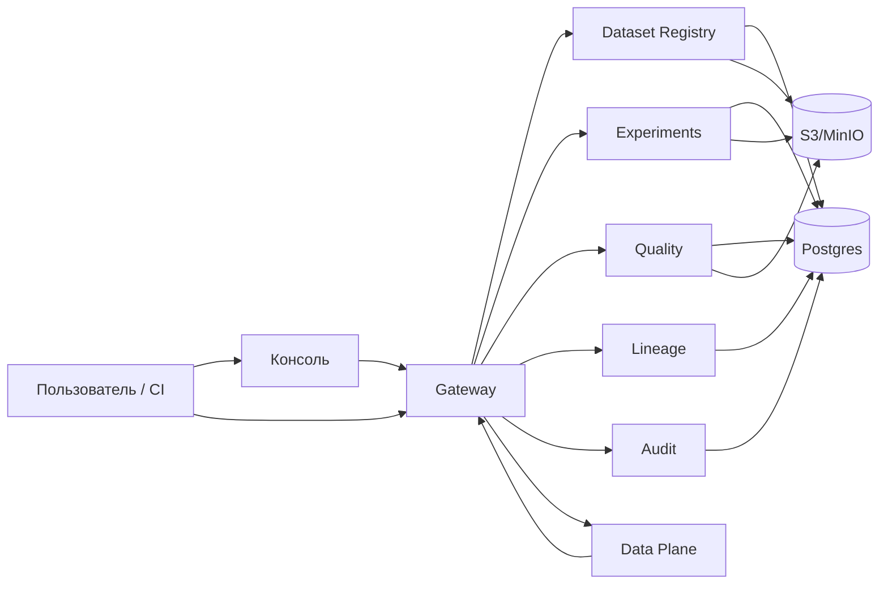
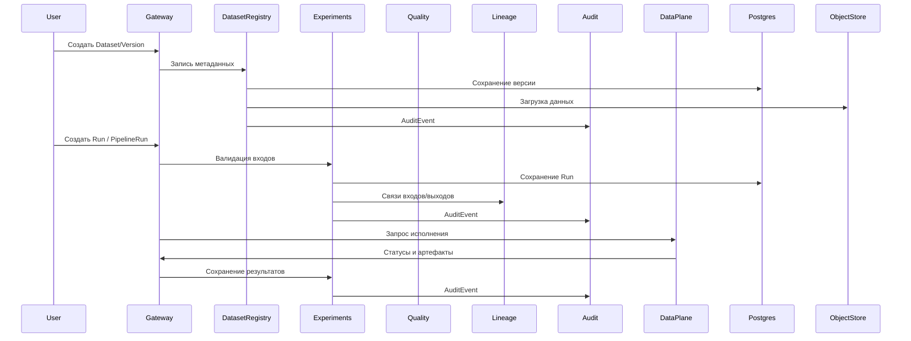

# Архитектура

Документ фиксирует структуру системы, интерфейсы и причинно‑следственные связи, что снижает риск расхождения между описанием и фактическим поведением.

## Высокоуровневая схема

## Компоненты и назначение

| Компонент | Действие | Практический эффект | Риск, который снижается |
| --- | --- | --- | --- |
| Gateway | принимает внешний трафик, выполняет аутентификацию и RBAC, проксирует запросы | единая точка входа и контроль доступа | обход политик и «теневые» интерфейсы |
| Control Plane (CP) | хранит метаданные, политики, аудит и планирование | воспроизводимость опирается на явный контекст | невоспроизводимые результаты из‑за скрытых зависимостей |
| Data Plane (DP) | исполняет пользовательский код и получает значения секретов | изоляция исполнения и контроль среды | запуск кода в доверенной плоскости |
| Postgres | хранит метаданные, аудит, lineage, очереди | сохранение доказательной базы | потеря данных и несоответствие аудиту |
| S3/MinIO | хранит датасеты и артефакты | воспроизводимость артефактов | утрата результатов и проверяемости |

## Ключевые системные связи
- **Контекст Run фиксируется как набор ссылок** (`DatasetVersion`, `CodeRef`, `EnvironmentLock`, `PolicySnapshot`), что обеспечивает проверяемость результата и исключает скрытое состояние.
- **Gateway изолирует внешний доступ**, что снижает риск обхода RBAC и прямого доступа к внутренним сервисам.
- **DP — единственная плоскость с доступом к секретам**, что снижает риск утечки в контрольной плоскости.
- **AuditEvent является append‑only**, что сохраняет доказательность и снижает риск подмены действий.

## Поток данных (обобщённо)

## Где искать детали
- Контракты API: `open/api/openapi/`
- Эксплуатация: `docs/ops/`
- Безопасность: `docs/open/02-security-and-compliance.md`
- Evidence‑формат: `docs/open/07-evidence-format.md`
